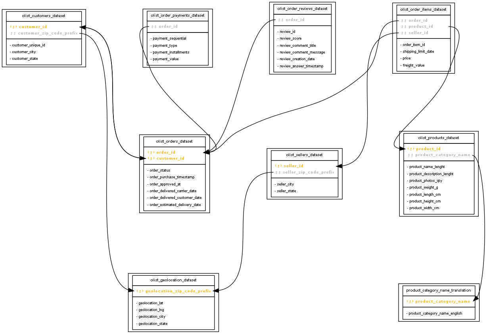

Exploratory Data Analysis of the Brazilian Ecommerce Dataset from Olist
==============================

Overview
---

This project contains a series of Jupyter notebooks designed to explore, analyze, and model a dataset related to 
e-commerce transactions. The data analysis journey covers fundamental data exploration, relationships discovery, 
spatial analysis, machine learning modeling, time series analysis, and data preparation for visualization in Tableau.
Data analysis on Brazilian E-commerce Public Dataset provided by Olist.

Tools Used
---
- Python
  - databridger* 
  - pandas
  - matplotlib, seaborn, folium
  - sklearn (Linear Regression, KMeans)
  - statsmodels.tsa
- Tableau

*see side note below

Links
---
[Tableau Story](https://public.tableau.com/app/profile/vyndell.michael/viz/cf_Brazilian_Ecommerce_Data_Analysis/Story1)

_Note that the Tableau story is an add-on to the Jupyter Notebooks._

Side Note
---

This project also serves as a source of inspiration for automation and supportive tasks in data analysis, which will be 
further developed as part of my current side project; the [`databridger` library on GitHub](https://github.com/vmichael89/databridger), 
which I am developing alongside my journey in data analytics. Some notable ideas for `databridger` being persued include:
- **Automatic Column Classification**
- **Generic Analysis of Inter-Table Key Relationships**: Identify primary and foreign keys.
- **Issue Tracker Implementation**: A class to log, track, manage and document issues found during the analysis phase.

Project Structure
------------

    ├── README.md
    │
    ├── data
    │   ├── raw             # olist data set
    │   ├── prepared        # prepared data for Tableau story
    │
    ├── notebooks
    │   ├── 1-data-exploration.ipynb
    │   ├── 2-exploring-relationships.ipynb
    │   ├── 3-spatial-analysis.ipynb
    │   ├── 4-linear-regression.ipynb
    │   ├── 5-KNN.ipynb
    │   ├── 6-timeseries-analysis-on-sales.ipynb
    │   ├── 7-data-prep-for-storyboard.ipynb
    │
    ├── reports 
    │   └── figures
    │
    ├── requirements.txt   

Entity Relationship Diagram
---
(Official)

(Generated with databridger)

Notebooks summary
---

1. **Data Exploration**:
Deep dive into the database to understand its structure.
Custom classes and methods introduced for enhanced data formatting.
Issues during data exploration are tracked using an "IssueTracker".
2. **Exploring Relationships**:
Focuses on understanding the relationships between different variables.
High correlation pairs are identified.
Both numerical and categorical variables, like the `review score`, are explored.
3. **Spatial Analysis**:
Emphasis on geographical patterns, particularly related to Brazilian states.
Uses `folium` for geospatial visualizations.
4. **Linear Regression**:
Builds and evaluates linear regression models.
Particular emphasis on variables like `freight value`.
Both simple and multiple linear regression techniques are applied.
5. **KMeans Clustering**:
Applies the KMeans clustering algorithm to identify patterns or groups within the data.
Data scaling and transformations are emphasized for effective clustering.
6. **Time Series Analysis on Sales**:
Concentrates on sales data, analyzing its trend, seasonality, and autocorrelations.
Techniques like **decomposition** are used to understand the time-dependent structure.
7. **Data Preparation for Storyboard**:
Preprocesses and prepares data specifically for visualization in **Tableau**.
Multiple datasets, such as customer data, geolocation data, order data, product data, etc., are processed.

Most Interesting Findings
---
The time series analysis reveals the importance of Black Friday sales.

One of the main contributors to customer satisfaction is the delivery lead time.

